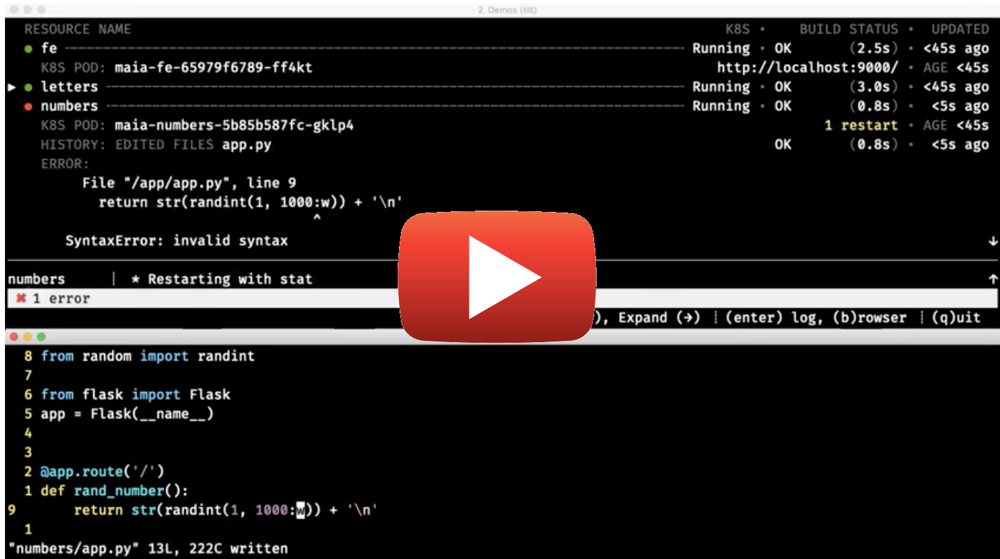

# Tilt

[](https://circleci.com/gh/windmilleng/tilt)
[](https://godoc.org/github.com/windmilleng/tilt)

Local Kubernetes development with no stress.

[Tilt](https://tilt.build) helps you develop your microservices locally.
Run `tilt up` to start working on your services in a complete dev environment
configured for your team.

Tilt watches your files for edits, automatically builds your container images,
and applies any changes to bring your environment
up-to-date in real-time. Think `docker build && kubectl apply` or `docker-compose`.

The screencast below demonstrates what a typical Tilt session looks like:
starting multiple microservices, making changes to them, and seeing any new errors
or logs right in your terminal.

[](https://www.youtube.com/watch?v=MGeUUmdtdKA)

## Install Tilt

If you don't know where to start, start here:

[Complete Tilt User Guide](https://docs.tilt.build/)

Download the Tilt binary on
[the github releases page](https://github.com/windmilleng/tilt/releases).

Tilt expects that you already have Docker and `kubectl` installed.
Read the more detailed [Installation Guide](https://docs.tilt.build/install.html)
to help you `tilt up` quickly.

## Configure Your Workflow to Share With Your Team

Down with YAML!

Configure Tilt with a `Tiltfile`, written in a small subset of Python called
[Starlark](https://github.com/bazelbuild/starlark#tour).

To get started, check out some [examples](https://docs.tilt.build/first_example.html) or dive into the
[API reference](https://docs.tilt.build/api.html).

## Community

Questions? Comments? Just want to say hi?

Find us on the Kubernetes slack. Get an invite at [slack.k8s.io](http://slack.k8s.io) and find
us in [the **#tilt** channel](https://kubernetes.slack.com/messages/CESBL84MV/).

We tweet at [windmill_eng](https://twitter.com/windmill_eng) and
blog about building Tilt at [medium.com/windmill-engineering](https://medium.com/windmill-engineering).

## Development

To make changes to Tilt, read the [developer guide](DEVELOPING.md).

For bugs and feature requests, file an [issue](https://github.com/windmilleng/tilt/issues)
or check out the [feature roadmap](ROADMAP.md).

## Privacy

This tool can send usage reports to https://events.windmill.build, to help us
understand what features people use. We only report on which `tilt` commands
run and how long they run for.

You can enable usage reports by running

```
tilt analytics opt in
```

(and disable them by running `tilt analytics opt out`.)

We do not report any personally identifiable information. We do not report any
identifiable data about your code.

We do not share this data with anyone who is not an employee of Windmill
Engineering. Data may be sent to third-party service providers like Datadog,
but only to help us analyze the data.

## License

Copyright 2018 Windmill Engineering

Licensed under [the Apache License, Version 2.0](LICENSE)

### Code Visualization:

If you want the good work to continue please support us on

 [](https://www.youtube.com/watch?v=95goFeNE4UY)

 [https://www.youtube.com/watch?v=95goFeNE4UY](https://www.youtube.com/watch?v=95goFeNE4UY)

