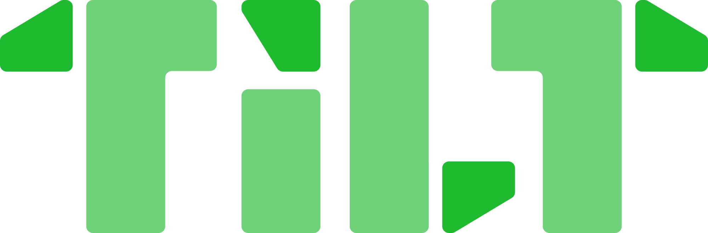
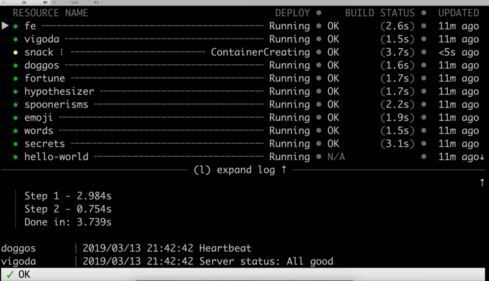
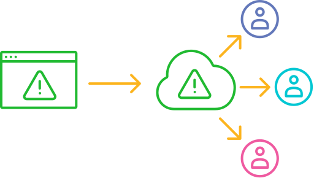

# Tilt



[](https://circleci.com/gh/windmilleng/tilt)
[](https://godoc.org/github.com/windmilleng/tilt)

Local Kubernetes development with no stress.

[Tilt](https://tilt.dev) helps you develop your microservices locally.
Run `tilt up` to start working on your services in a complete dev environment
configured for your team.

Tilt watches your files for edits, automatically builds your container images,
and applies any changes to bring your environment
up-to-date in real-time. Think `docker build && kubectl apply` or `docker-compose up`.

## Watch: Tilt in Two Minutes

[](https://www.youtube.com/watch?v=oSljj0zHd7U)

## Install Tilt

Installing the `tilt` binary is a one-step command:

```bash
curl -fsSL https://raw.githubusercontent.com/windmilleng/tilt/master/scripts/install.sh | bash
```

For other installation options, see the [Installation Guide](https://docs.tilt.dev/install.html).

## Run Tilt

Use [this guide](https://docs.tilt.dev/tutorial.html) to run Tilt on your project.

Tilt automatically handles all the expert tricks for working in a Kubernetes dev environment:

- Stands up any constellation of services, no matter how complex

- Watches your file system and update servers in seconds

- Streams logs, events, and pod changes so that it can show you the problem when
something breaks

## Don’t Tilt Alone, Take This

[](https://docs.tilt.dev/snapshots.html)

Are you seeing an error from a server that you don't even work on?

With Tilt Cloud, create web-based interactive reproductions of your local cluster’s state.

Save and share [a snapshot](https://docs.tilt.dev/snapshots.html) with your team
so that they can dig into the problem later. A snapshot lets you explore the
status of running services, errors, logs, and more.

## Community & Contributions

**Questions and feedback:** Join [the Kubernetes slack](http://slack.k8s.io) and
 find us in the [#tilt](https://kubernetes.slack.com/messages/CESBL84MV/)
 channel. Or [file an issue](https://github.com/windmilleng/tilt/issues).

**Contribute:** Check out our [contribution](CONTRIBUTING.md) guidelines.

**Follow along:** [@tilt_dev](https://twitter.com/tilt_dev) on Twitter. Updates
and announcements on the [Tilt blog](https://blog.tilt.dev).

**Help us make Tilt even better:** Tilt sends anonymized usage data, so we can
improve Tilt on every platform. Details in ["What does Tilt
send?"](http://docs.tilt.dev/telemetry_faq.html).

We expect everyone in our community (users, contributors, followers, and employees alike) to abide by our [**Code of Conduct**](CODE_OF_CONDUCT.md).

## License

Copyright 2018 Windmill Engineering

Licensed under [the Apache License, Version 2.0](LICENSE)
