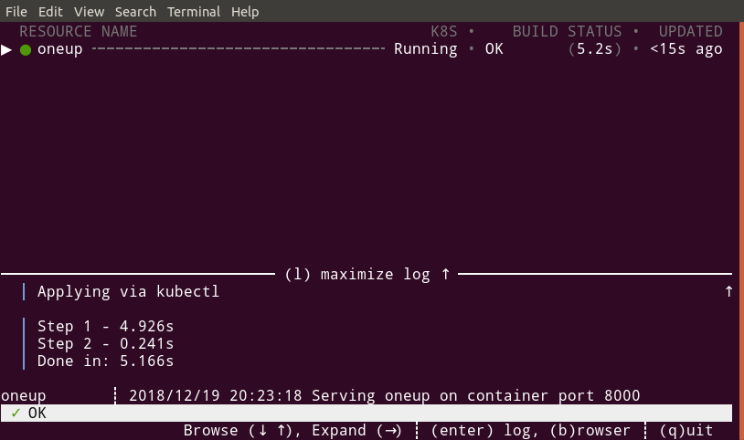

Running your First Tilt Project
===============================

This tutorial assumes you already have `tilt` and its dependencies set up,
and configured for a local cluster.

For your first Tilt project, let's not worry about configuring a project just yet.
Let's look at a simple existing project and see how easy it is to
`tilt up` and go.

First, check out the Tilt repo.

```
git clone https://github.com/windmilleng/tilt
cd tilt/integration/oneup
```

Under `integration`, Tilt has example projects that we use to run our integration tests.
We'll be looking at the [oneup](https://github.com/windmilleng/tilt/tree/master/integration/oneup) project
in `integration/oneup`.

In the oneup directory, run

```
tilt up oneup
```

Your terminal will turn into a status box that lets you watch your server come up.

When it's ready, type `Enter` to see the oneup logs.



Congratulations! You've run your first server with `tilt`.

Type `q` to quit the status box. When you're finished, run

```
tilt down oneup
```

to turn off the server.


Next Steps
----------

In the next guide, we're going to learn
[how to configure your own project](first_config.html)
to run with Tilt.


