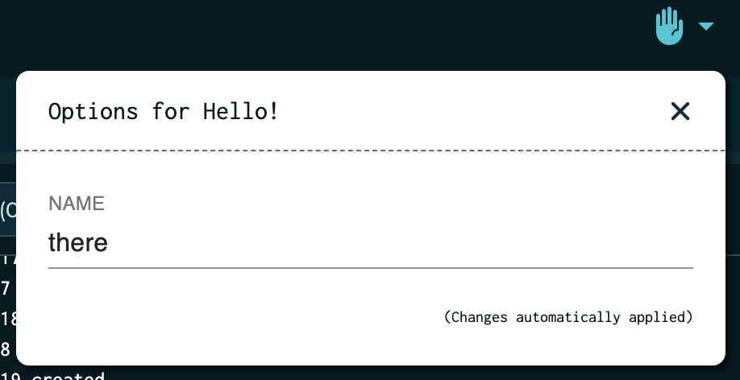

# UIButton

Authors:
 * [Matt Landis](https://github.com/landism)
 * [Milas Bowman](https://github.com/milas)

Extend the Tilt UI with custom actions for your resources.

## Functions

### `cmd_button(name, resource, argv, text=None, location=location.RESOURCE, icon_name=None, icon_svg=None)`

Creates a button for a resource that runs the given command when clicked.

| Argument | Type | Description |
| -------- | ---- | ----------- |
| `name`      | `str`            | Unique ID for button |
| `resource`  | `str`            | Resource to associate button with (required if `location=location.RESOURCE`) |
| `argv`      | `List[str]`      | Local command to run when button is clicked |
| `text`      | `str`            | Text to display on button (optional: defaults to `name`) |
| `location`  | `str` (enum)     | Button placement in UI (see `location` section below) |
| `icon_name` | `str`            | Name of [Material Icons font ligature][material-icons-font] to use as icon (at most one of `icon_name` or `icon_svg` should be specified) |
| `icon_svg`  | `str` or `Blob`  | `<svg>` to use as icon; should have 24x24px viewport (at most one of `icon_name` or `icon_svg` should be specified) |

### `location`
To specify button location, you can bind the `location` helper type or pass a string, e.g. `location=location.NAV` and `location='nav'` are equivalent.

| Location   | `str` Value | `location` Value    |
| ---------- | ----------- | ------------------- |
| Resource   | `resource`  | `location.RESOURCE` |
| Global nav | `nav`       | `location.NAV`      |

### `text_input(name, label='', default='', placeholder='')`
Specifies that the button's UI will include a text field the user can enter.
The field's current value will be set in the command's env when it is run.

| Argument      | Type  | Description |
| ------------- | ----- | ----------- |
| `name`        | `str` | The text input's name. Also the name of the environment variable to be set when running the command. |
| `label`       | `str` | Text to display next to the text input in the UI. |
| `default`     | `str` | Default initial value for this field. |
| `placeholder` | `str` | A short hint that describes the expected input of this field. |

### `bool_input(name, label='', default=False, true_string=None, false_string=None)`
Specifies that the button's UI will include a checkbox to toggle this value.
When the command is run, an environment variable will be set based on the
checkbox's state. By default, the variable will be set to the string `"true"` or `"false"`, as appropriate. Those values can be configured with the `true_string` and `false_string` parameters.

| Argument       | Type   | Description |
| -------------- | -----  | ----------- |
| `name`         | `str`  | The input's name. Also the name of the environment variable to be set when running the command. |
| `label`        | `str`  | Text to display next to the input in the UI. |
| `default`      | `bool` | Default initial value for this field. |
| `true_string`  | `str`  | If not None, when the checkbox is checked, the environment variable will be set to this string instead of "true". |
| `false_string` | `str`  | If not None, when the checkbox is checked, the environment variable will be set to this string instead of "false". |

## Example Usage

```python
load('ext://uibutton', 'cmd_button', 'location', 'text_input')

# define resource 'my-resource'
# k8s_resource('my-resource')

# create a button on resource 'my-resource'
cmd_button(name='my-resource-hello-world',
           resource='my-resource',
           argv=['echo', 'Hello my-resource!'],
           text='Hello World',
           icon_name='travel_explore')

cmd_button(name='nav-hello-world',
           argv=['echo', 'Hello nav!'],
           text='Hello World',
           location=location.NAV,
           icon_name='waving_hand')

cmd_button(name='foo',
           resource='my-resource',
           text='Reseed database',
           inputs=[
             text_input('SHARD'),
           ],
           # If you need env var expansion *within the command itself*
           # you'll need to run it via a shell.
           argv=['/bin/sh', '-c', './reseed_database.sh --shard="$SHARD"'],
   )
```

## Button Placement
Currently, you can create buttons for a specific resource, which will be shown with other resource contextual actions such as "Copy Pod ID" or as part of the global nav next to the help and account buttons.

### Resource
To create a resource button, pass the resource name via `resource='my-resource'` and omit the `location` argument or explicitly pass `location=location.RESOURCE`.

Any command output will appear interleaved with the associated resource's logs.

Providing an icon is optional.

### Global Nav
To create a global nav button, pass `location=location.NAV` and omit the `resource` argument or explicitly pass `resource=None`.

Any command output will appear in the "All Resources" log view under `(global)`.

Global nav buttons SHOULD specify an icon via either the `icon_name` or `icon_svg` arguments. The `text` value will appear on hover.

## Icons
Button icons can either come from the set of built-in icons that ship with Tilt or a custom SVG.

Navbar buttons SHOULD include an icon as the button text is only visible on hover.
For resource buttons, icons are optional and will appear within the button if specified.

If both `icon_name` and `icon_svg` are specified, `icon_svg` will take precedence.

### Built-in Icons (Material Icons)
Tilt includes the [Material Icons][material-icons-font] by default.
Use the `icon_name` argument and pass the "font ligature" value for your desired icon.
The font ligatures are visible in the sidebar after clicking on an icon on the Material Fonts site.
Tip: They are `lower_snake_case` values, e.g. the "Check Circle" icon has a font ligature value of `check_circle`.

### Custom Icons (SVG)
Use the `icon_svg` argument and pass a full `<svg>` element.
The SVG viewport should be 24x24 for best results.

To avoid string quoting issues, it's often easiest to load the SVG from disk rather than storing it directly in your Tiltfile:
```python
load('ext://uibutton', 'cmd_button', 'location')

icon = read_file('./icon.svg')

cmd_button('svg-btn',
           argv=['echo', '✨ Hello from SVG ✨'],
           location=location.NAV,
           icon_svg=icon,
           text='SVG Nav Button') # text will appear on hover
```

## Inputs
If a button has inputs, the UI will attach an arrow to the button, allowing the
user to set those inputs' values.
When the button is clicked, those input's values will be set as environment
variables in the executed process.
For example:
```python
cmd_button('hello',
           argv=['sh', '-c', 'echo Hello, $NAME'],
           location=location.NAV,
           icon_name='front_hand',
           text='Hello!',
           inputs=[
             text_input('NAME', placeholder='Enter your name'),
           ]
)
```

This will create a button (top right) with an options menu (opened by the little arrow):


When the user clicks the button to run its command, `$NAME` will be set
to the field's value, e.g.:

```
Running cmd: echo Hello, $NAME
Hello, there
```

Note that if the command needs an env var expanded inside the command itself (e.g., it directly uses `$NAME`, rather than simply invoking a program that uses `$NAME`), it will need to be wrapped in a shell call, e.g. ['sh', '-c', 'mycommand $NAME'].

## Other notes

Commands are executed locally on the host running `tilt up` (similar to `local_resource`).

The `argv` argument only accepts a list, e.g. `['echo', 'Hello World']` but not `echo 'Hello World'`.

To run a script, invoke the interpreter and then pass the script as an argument, e.g. `['bash', '-c', 'echo "Hello from bash ${BASH_VERSION}"']`.

## Known Issues
* Renamed/deleted buttons will not be removed until Tilt is restarted ([#193](https://github.com/tilt-dev/tilt-extensions/issues/193))

[material-icons-font]: https://fonts.google.com/icons
